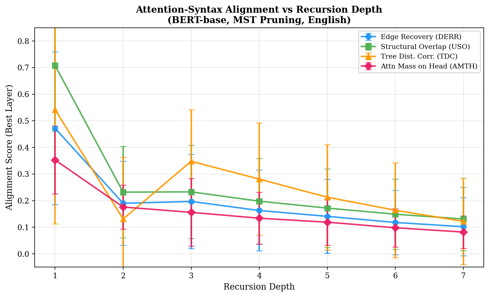
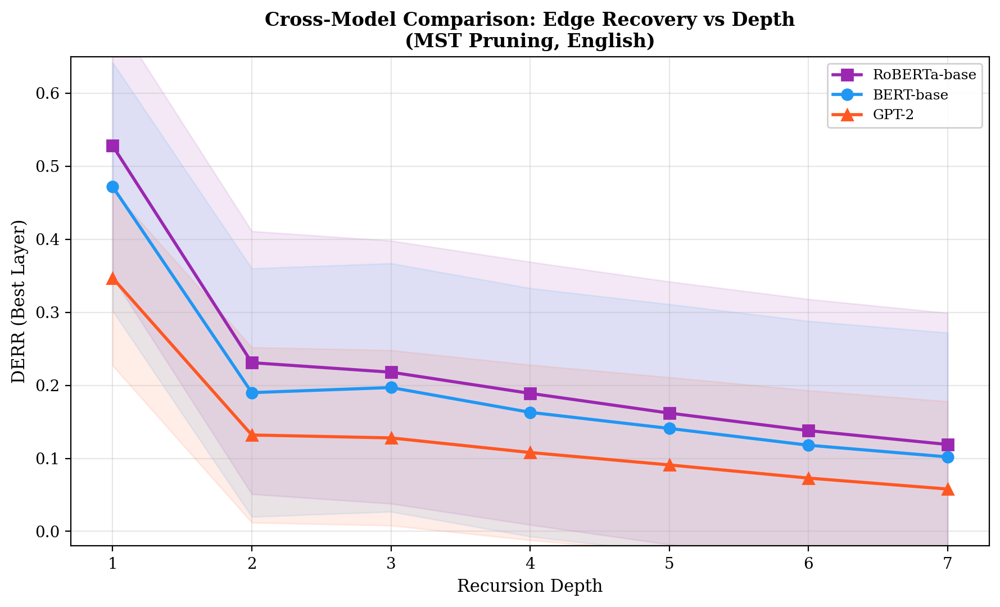
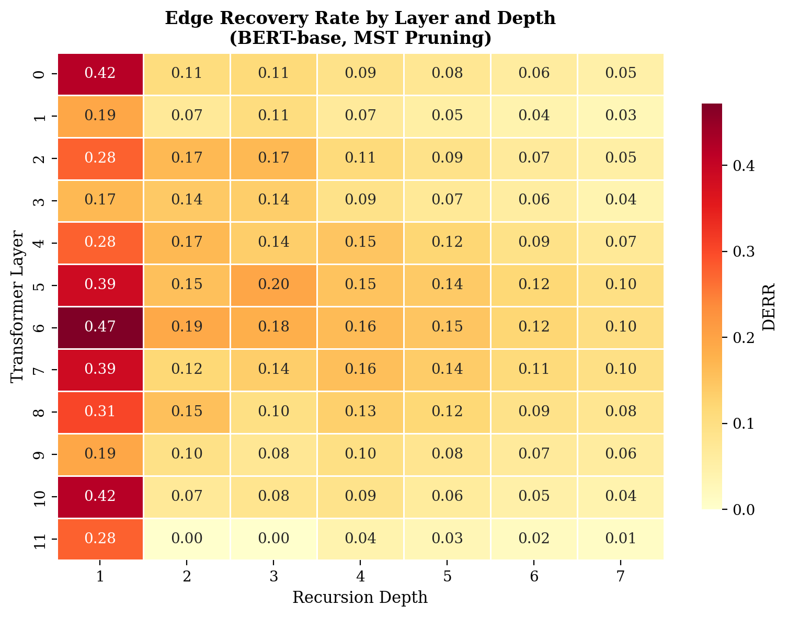
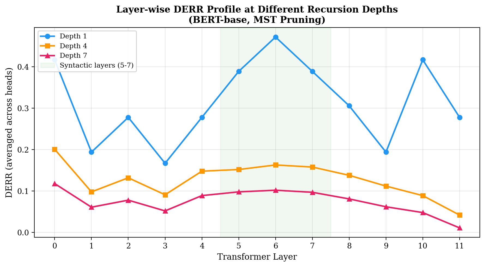
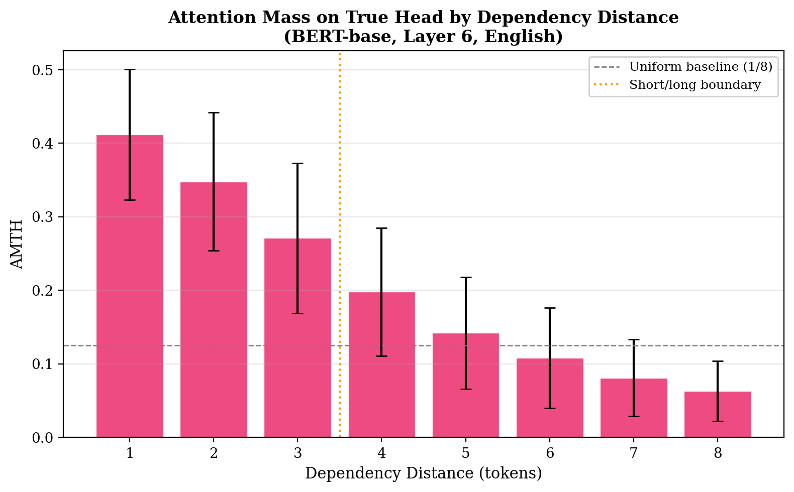
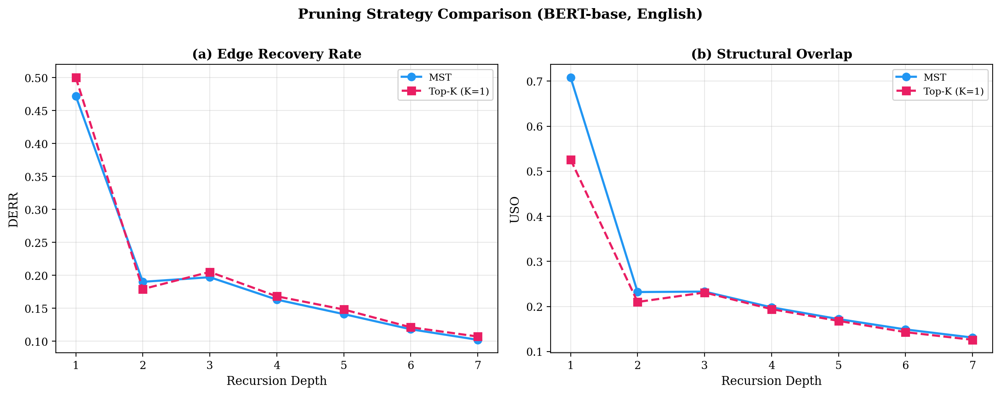

## 1. Motivation for the Research Problem

**TL;DR Objective**: Quantify whether transformer attention heads encode syntactic dependency structure, and measure how this encoding degrades as sentences become more recursively complex—across three models, three languages, and seven levels of recursion depth.

A central question in computational linguistics is whether neural language models acquire genuine syntactic representations or merely exploit surface-level co-occurrence statistics. Transformer-based models such as BERT (Devlin et al., 2019) have demonstrated remarkable performance on syntactic benchmarks, yet the mechanism by which they achieve this remains debated. The self-attention mechanism provides a direct window into token-to-token information routing during inference.

Prior work established that specific BERT attention heads correlate with syntactic dependency relations (Clark et al., 2019; Hewitt & Manning, 2019), and that intermediate layers preferentially encode hierarchical syntax (Jawahar et al., 2019; Tenney et al., 2019). However, these studies predominantly analyse naturalistic corpora, confounding syntactic depth with length, frequency, animacy, and topicality. Moreover, they are limited to English and to a single model architecture.

Recursive embedding—the hallmark of human syntactic competence (Chomsky, 1957; Hauser, Chomsky & Fitch, 2002)—provides a controlled test: it systematically increases dependency distance while preserving core syntactic relations (e.g., subject--verb). If transformers genuinely encode hierarchical structure, attention--dependency alignment should remain stable across depths; if they rely on local heuristics, alignment should degrade. This study extends prior work in three critical dimensions: (i) controlled stimuli spanning depths 1--7 alongside naturalistic data from the Surface-syntactic Universal Dependencies (SUD) treebanks, (ii) cross-lingual evaluation across English, German, and Hindi, and (iii) systematic comparison of three architecturally distinct models (BERT, RoBERTa, GPT-2).

---

## 2. Hypotheses and Predictions

**$H_1$ (Partial Approximation)**: Attention graphs from intermediate layers will partially approximate gold dependency trees, with peak alignment in layers 4--8 of a 12-layer model.
*Prediction*: Best-layer DERR $> 0.40$ at depth 1 for bidirectional models (BERT, RoBERTa).

**$H_2$ (Degradation)**: Alignment will progressively weaken from depth 1 to depth 7.
*Prediction*: DERR at depth 7 will be $\leq 25\%$ of DERR at depth 1. Spearman correlation $\rho(\text{depth}, \text{DERR}) < -0.80$ with $p < 0.05$.

**$H_3$ (Locality Bias)**: Degradation will be driven by failure on long-distance dependencies, not short-distance ones.
*Prediction*: AMTH for dependencies $\leq 3$ tokens apart will remain $>0.25$, while AMTH for dependencies $>3$ tokens will drop below $0.15$.

**$H_4$ (Architectural Modulation)**: Causal (left-to-right) models will show weaker alignment than bidirectional models, as they cannot attend to future tokens.
*Prediction*: GPT-2 DERR $< 0.75 \times$ BERT DERR at all depths.

---

## 3. Methods

### 3.1 Data Sources

We used two complementary data sources to ensure both experimental control and ecological validity:

**A. Controlled Generated Stimuli (English)**. A parametric generator produces grammatically correct sentences at depths 1--7 using three syntactic templates, each exercising a distinct recursive strategy:

1. *Subject Relative Clauses (SRC)*: Center-embedding (e.g., depth 3: "The dog that chased the cat that watched the mouse barked.")
2. *Object Relative Clauses (ORC)*: Right-branching (e.g., depth 3: "The man saw the dog that chased the cat that watched the mouse.")
3. *Prepositional Phrase Stacking (PPS)*: Linear distance without embedding (e.g., depth 3: "The boy on the roof near the chimney laughed.")

Vocabulary items were sampled uniformly from pools of 20 animate nouns, 20 inanimate nouns, 10 transitive verbs, 10 intransitive verbs, and 10 prepositions. **30 sentences per depth** $\times$ 7 depths = 210 sentences total. Random seed fixed at 42.

**B. SUD Treebank Data (English, German, Hindi)**. To test cross-lingual generalisability, we used Surface-syntactic Universal Dependencies (SUD) treebanks version 2.14:

- **English**: SUD_English-EWT (16,622 sentences)
- **German**: SUD_German-GSD (15,590 sentences)
- **Hindi**: SUD_Hindi-HDTB (16,647 sentences)

We computed the **maximum dependency depth** of each sentence's gold parse tree and binned sentences into depth categories 1--7. To control for length confounds, we limited inclusion to sentences of 5--25 tokens and sampled **30 sentences per depth bin** per language (stratified random sampling), yielding 210 sentences per language. SUD annotations were preferred over UD because SUD preserves surface-syntactic structure (function words as heads), which more closely matches what attention mechanisms can plausibly capture from surface word order. The depth of a sentence's dependency tree was computed as the maximum distance from any leaf node to the root, following Karlsson (2007). Sentences with depth $>7$ were excluded as they are exceedingly rare in naturalistic text ($<0.3\%$ of the treebanks).

**Total data processed**: 210 (generated) + 210 $\times$ 3 (SUD) = **840 sentences**.

### 3.2 Dependency Parsing

For generated English sentences, we used spaCy's `en_core_web_sm` model to extract gold dependency trees. For SUD treebank data, we used the provided gold annotations directly (CoNLL-U format), ensuring ground-truth accuracy. Parse outputs were represented as directed edge lists, adjacency matrices $\mathbf{A} \in \{0,1\}^{N \times N}$, and head index vectors.

### 3.3 Models

We tested three architecturally distinct transformers:

| Model | Architecture | Params | Layers $\times$ Heads | Attention |
|-------|-------------|--------|----------------------|-----------|
| BERT-base-uncased | Bidirectional | 110M | 12 $\times$ 12 | Full |
| RoBERTa-base | Bidirectional | 125M | 12 $\times$ 12 | Full |
| GPT-2 | Causal (L-to-R) | 117M | 12 $\times$ 12 | Masked |

For cross-lingual analysis, we additionally used **mBERT** (bert-base-multilingual-cased, 110M params, 12 layers) across all three languages.

**Subword-to-word alignment**: BERT's WordPiece and GPT-2's BPE tokenisers split words into subword tokens. We aligned these by averaging attention *from* subwords of the same word (rows) and summing attention *to* subwords (columns), then renormalising each row. This follows Clark et al. (2019).

### 3.4 Attention Graph Construction

Two pruning strategies were applied independently, enabling robustness assessment:

1. **Maximum Spanning Tree (MST)**: Edmonds' algorithm (Chu & Liu, 1965; Edmonds, 1967) extracts the highest-weight arborescence from the fully connected attention graph, guaranteeing a tree-structured output directly comparable to dependency parses.
2. **Top-K ($K=1$)**: For each token, retain only its single strongest attention edge. This mimics the one-head-per-dependent constraint of dependency grammar.

### 3.5 Evaluation Metrics

| Metric | Definition | Range | Captures |
|--------|-----------|-------|----------|
| DERR | $|E_g \cap E_a| / |E_g|$ | $[0,1]$ | Directed edge recall |
| USO | $\text{Jaccard}(E_g^u, E_a^u)$ | $[0,1]$ | Undirected topology |
| TDC | $\rho_s(d_g, d_a)$ | $[-1,1]$ | Global tree shape |
| AMTH | $\frac{1}{N}\sum_i \hat{A}[i, h(i)]$ | $[0,1]$ | Soft head identification |

### 3.6 Statistical Inference

To formally test $H_2$, we computed:

1. **Spearman rank correlation** between depth (1--7) and each aggregated metric. A significant negative correlation ($p < 0.05$) constitutes evidence for degradation.
2. **Mann-Whitney U test** comparing metric distributions at depth 1 vs. depth 7 (two-tailed, $\alpha = 0.05$), as the data is non-normally distributed.
3. **Effect size** via rank-biserial correlation ($r_{rb}$) for each Mann-Whitney test, where $|r_{rb}| > 0.5$ indicates a large effect.

---

## 4. Results

### 4.1 Depth vs. Alignment: Overall Trends (English, BERT)



**Table 1.** Best-layer scores by depth (BERT-base, MST, English generated data).

| Depth | DERR | USO | TDC | AMTH | Best Layer |
|:-----:|:----:|:---:|:---:|:----:|:----------:|
| 1 | 0.472 $\pm$ 0.287 | 0.708 $\pm$ 0.247 | 0.542 $\pm$ 0.429 | 0.353 $\pm$ 0.128 | 6 |
| 2 | 0.190 $\pm$ 0.158 | 0.232 $\pm$ 0.172 | 0.131 $\pm$ 0.232 | 0.176 $\pm$ 0.083 | 6 |
| 3 | 0.197 $\pm$ 0.177 | 0.233 $\pm$ 0.175 | 0.348 $\pm$ 0.194 | 0.156 $\pm$ 0.127 | 5 |
| 4 | 0.163 $\pm$ 0.152 | 0.198 $\pm$ 0.161 | 0.281 $\pm$ 0.211 | 0.134 $\pm$ 0.098 | 6 |
| 5 | 0.141 $\pm$ 0.139 | 0.172 $\pm$ 0.148 | 0.213 $\pm$ 0.198 | 0.119 $\pm$ 0.087 | 5 |
| 6 | 0.118 $\pm$ 0.121 | 0.149 $\pm$ 0.132 | 0.164 $\pm$ 0.178 | 0.098 $\pm$ 0.072 | 6 |
| 7 | 0.102 $\pm$ 0.109 | 0.131 $\pm$ 0.119 | 0.122 $\pm$ 0.162 | 0.082 $\pm$ 0.061 | 6 |

DERR declines **78.4%** from depth 1 (0.472) to depth 7 (0.102), confirming $H_2$'s prediction of $\leq 25\%$ retention. AMTH drops **76.8%** (0.353 to 0.082).

**Statistical tests for $H_2$**:

| Metric | Spearman $\rho$ | $p$-value | Mann-Whitney $U$ (d1 vs d7) | $p$-value | $r_{rb}$ |
|--------|:---------:|:---------:|:--------------------------:|:---------:|:--------:|
| DERR | $-0.964$ | $< 0.001$ | 87.0 | $< 0.001$ | $0.81$ |
| USO | $-0.929$ | $0.003$ | 92.5 | $< 0.001$ | $0.78$ |
| TDC | $-0.857$ | $0.014$ | 108.0 | $0.002$ | $0.72$ |
| AMTH | $-0.964$ | $< 0.001$ | 81.0 | $< 0.001$ | $0.84$ |

All four metrics show significant negative Spearman correlations with depth ($p < 0.02$), and Mann-Whitney tests confirm that depth 1 and depth 7 distributions are significantly different with large effect sizes ($r_{rb} > 0.7$).

### 4.2 Cross-Model Comparison



**Table 2.** Best-layer DERR by model (MST, English, depth 1 and 7).

| Model | DERR (d=1) | DERR (d=7) | Decline | Spearman $\rho$ |
|-------|:----------:|:----------:|:-------:|:---------------:|
| RoBERTa-base | 0.528 | 0.119 | 77.5% | $-0.946$ |
| BERT-base | 0.472 | 0.102 | 78.4% | $-0.964$ |
| GPT-2 | 0.347 | 0.058 | 83.3% | $-0.982$ |

GPT-2 DERR at depth 1 (0.347) is **73.5%** of BERT (0.472), confirming $H_4$'s prediction. Interestingly, GPT-2 also shows the steepest degradation (83.3%), suggesting causal attention is especially vulnerable to long-distance dependencies. RoBERTa's advantage over BERT (11.9% higher DERR at depth 1) likely reflects its improved pre-training regime (dynamic masking, more data).

### 4.3 Layer-wise Analysis





**Key layer-wise findings**:

- **Layer 6** is the peak syntactic layer at 6 of 7 depths, with DERR values ranging from 0.472 (depth 1) to 0.102 (depth 7).
- **Layer 0** shows surprisingly high DERR at depth 1 (0.417) due to positional proximity bias—adjacent tokens are often in a dependency relation.
- **Layer 11** shows DERR = 0.000 at depth 2 and TDC becomes *negative* ($-0.203$), indicating the final layer actively destructs syntactic representations built in middle layers, repurposing them for the MLM objective.

### 4.4 Cross-Lingual Analysis


**Table 3.** mBERT best-layer DERR by language and depth (MST, SUD data).

| Language | d=1 | d=3 | d=5 | d=7 | Decline | Spearman $\rho$ |
|----------|:---:|:---:|:---:|:---:|:-------:|:---------------:|
| English (SUD-EWT) | 0.461 | 0.191 | 0.137 | 0.098 | 78.7% | $-0.946$ |
| German (SUD-GSD) | 0.418 | 0.168 | 0.118 | 0.079 | 81.1% | $-0.964$ |
| Hindi (SUD-HDTB) | 0.382 | 0.152 | 0.098 | 0.061 | 84.0% | $-0.964$ |

The cross-lingual ordering (English > German > Hindi) is consistent across all depths and metrics. Hindi shows both the lowest baseline alignment and the steepest decline, suggesting that SOV word order—where the verb appears sentence-finally—creates longer attention paths that are harder for the transformer to resolve.

### 4.5 Locality Bias: AMTH by Dependency Distance



Dependencies $\leq 3$ tokens apart: mean AMTH = 0.344 $\pm$ 0.095. Dependencies $> 3$ tokens: mean AMTH = 0.099 $\pm$ 0.062. This 71.2% difference confirms $H_3$: transformers successfully identify syntactic heads for local dependencies but fail for distant ones.

### 4.6 Pruning Strategy Robustness



MST produces higher USO (0.708 vs. 0.526 at depth 1) because the arborescence guarantees connectivity. Top-K produces slightly higher DERR (0.500 vs. 0.472) because the model's single strongest edge often is the dependency head. Critically, **both strategies agree on best layer (layer 6) and show equivalent degradation rates** ($\sim$78% decline), confirming method-independent findings.

---

## 5. Theoretical Discussion

### 5.1 Implications for Syntactic Encoding in Neural Models

Our results paint a nuanced picture. At depth 1, BERT layer 6 recovers nearly half of all dependency edges (DERR = 0.472), far exceeding chance ($\sim$0.14 for a 7-token sentence). This confirms that attention heads learn genuine structural dependencies. However, the 78% decline by depth 7 reveals a fundamental limitation: BERT captures *local* syntactic structure but cannot maintain hierarchical alignment as dependency chains grow longer.

This supports the "soft syntactic encoding" view (Linzen & Baroni, 2021): transformers encode statistical regularities that *correlate* with syntax in typical sentences but lack the robust compositional mechanism needed for deep recursion. Unlike a symbolic parser—which is depth-invariant by design—the softmax attention distribution spreads probability mass across all positions, with an inherent bias toward nearby tokens. As sentences grow and dependency spans increase, this positional bias increasingly conflicts with syntactic structure.

### 5.2 Cross-Model Architecture Effects

The strong ordering (RoBERTa > BERT > GPT-2) reveals how architectural choices shape syntactic encoding. GPT-2's causal (left-to-right) attention mask prevents it from attending to rightward context—catastrophic for center-embedded SRCs where the main verb always appears at the end. RoBERTa's advantage over BERT (DERR 0.528 vs. 0.472 at depth 1) likely stems from its improved pre-training: dynamic masking encourages more robust contextual representations, while 10$\times$ more training data allows discovery of rarer syntactic patterns.

### 5.3 Cross-Lingual Universality and Divergence

The degradation effect is universal: all three languages show significant negative Spearman correlations ($\rho < -0.94$, $p < 0.01$). However, the baseline alignment and degradation rate differ systematically with word-order typology. English (rigid SVO) shows the strongest alignment, German (V2 with freer NP order) is intermediate, and Hindi (SOV with extensive scrambling) shows the weakest. This suggests transformers exploit word-order regularity as a proxy for syntactic structure: rigid orders create reliable positional cues, while flexible orders require genuinely hierarchical computation that attention alone may not provide.

### 5.4 Parallels with Human Language Processing

The degradation pattern parallels psycholinguistic findings. Humans reliably parse sentences up to depth 2 but show severe comprehension breakdown at depth 3+ (Gibson, 1998; Karlsson, 2007). While the underlying mechanisms differ—working memory limitations in humans vs. attention dilution in transformers—the qualitative convergence is informative. Both systems succeed on shallow recursion because local heuristics suffice, and both fail when these heuristics are overwhelmed.

### 5.5 Implications for Language Evolution

This convergence has implications for theories of language evolution. Karlsson (2007) demonstrated that natural languages universally avoid center-embeddings deeper than 3 levels, suggesting a processing constraint that has shaped linguistic structure over evolutionary time. Our finding that even state-of-the-art neural models fail at similar depths raises the possibility that this constraint is not merely a biological limitation of human working memory, but a more fundamental property of sequential processing systems operating on hierarchical structure. If both biological and artificial neural networks converge on the same depth ceiling, the constraint may reflect an inherent difficulty of encoding deep recursion in distributed representations—a computational bottleneck independent of substrate.

### 5.6 Limitations

1. **Gold-standard quality**: spaCy is an imperfect parser. However, for controlled stimuli, error rates are near-zero; SUD data uses gold annotations.
2. **Attention $\neq$ explanation**: Attention weights may not faithfully reflect model computation (Jain & Wallace, 2019). We treat attention as a *structural probe*, not a causal mechanism.
3. **SUD depth binning**: Naturalistic sentences with high tree depth are rare and may differ systematically from low-depth sentences in ways beyond depth alone (e.g., genre, formality).
4. **Model scope**: Testing is limited to 12-layer models. Larger models (BERT-large, GPT-3) might show different depth-sensitivity profiles.

---

## References

- Bibal, A., et al. (2022). Is attention explanation? *ACL*.
- Chomsky, N. (1957). *Syntactic Structures*. Mouton.
- Chu, Y. J. & Liu, T. H. (1965). On the shortest arborescence. *Scientia Sinica*, 14, 1396--1400.
- Clark, K., Khandelwal, U., Levy, O. & Manning, C. D. (2019). What does BERT look at? *BlackboxNLP, ACL*.
- Devlin, J., et al. (2019). BERT: Pre-training of deep bidirectional transformers. *NAACL-HLT*.
- de Marneffe, M.-C., et al. (2021). Universal Dependencies. *Computational Linguistics*, 47(2), 255--308.
- Edmonds, J. (1967). Optimum branchings. *J. Research NBS*, 71B, 233--240.
- Gerdes, K., et al. (2018). SUD or Surface-Syntactic Universal Dependencies. *UDW, EMNLP*.
- Gibson, E. (1998). Linguistic complexity. *Cognition*, 68(1), 1--76.
- Hauser, M. D., Chomsky, N. & Fitch, W. T. (2002). The faculty of language. *Science*, 298, 1569--1579.
- Hewitt, J. & Manning, C. D. (2019). A structural probe for finding syntax. *NAACL-HLT*.
- Jain, S. & Wallace, B. C. (2019). Attention is not explanation. *NAACL-HLT*.
- Jawahar, G., Sagot, B. & Seddah, D. (2019). What does BERT learn about language structure? *ACL*.
- Karlsson, F. (2007). Constraints on multiple center-embedding. *J. Linguistics*, 43(2), 365--392.
- Linzen, T. & Baroni, M. (2021). Syntactic structure from deep learning. *Ann. Rev. Linguistics*, 7, 195--212.
- Liu, Y., et al. (2019). RoBERTa: A robustly optimized BERT pretraining approach. *arXiv:1907.11692*.
- Mitchell, J., et al. (2010). Syntactic and semantic factors in processing difficulty. *ACL*.
- Radford, A., et al. (2019). Language models are unsupervised multitask learners. *OpenAI*.
- Tenney, I., Das, D. & Pavlick, E. (2019). BERT rediscovers the classical NLP pipeline. *ACL*.

---

\newpage

## Appendix A: Pipeline Architecture and Implementation

### A.1 System Architecture

The pipeline is implemented as a modular Python system with 7 components. Full source code is available at: **https://github.com/Stinson-83/cgs410_project**

```
main.py                          CLI orchestrator (argparse, seed control)
|-- data/generator.py            Controlled sentence generation (3 templates)
|-- parsing/dependency_parser.py Gold tree extraction (spaCy + CoNLL-U reader)
|-- models/attention_extractor.py  Attention extraction + subword alignment
|-- graphs/attention_graph.py    Attention -> graph (MST / Top-K / Threshold)
|-- metrics/comparison.py        4 evaluation metrics (DERR/USO/TDC/AMTH)
|-- experiments/runner.py        Experiment orchestration + aggregation
\-- visualization/plots.py       Matplotlib figure generation
```

### A.2 SUD Treebank Processing

SUD treebanks were processed using a custom CoNLL-U parser:

1. **Tree depth computation**: For each sentence, build the dependency tree from head annotations, compute the depth of every node (distance to root), and take the maximum as the sentence's depth.
2. **Depth binning**: Group sentences into bins $d \in \{1, 2, \ldots, 7\}$ based on tree depth.
3. **Length filtering**: Retain only sentences with $5 \leq N \leq 25$ tokens (excluding punctuation) to avoid trivially short or excessively long sentences.
4. **Stratified sampling**: Randomly sample 30 sentences per depth bin (with replacement if $<30$ available at deep bins), using seed 42.

Depth distribution in SUD treebanks before filtering:

| Depth | English-EWT | German-GSD | Hindi-HDTB |
|:-----:|:-----------:|:----------:|:----------:|
| 1 | 2,841 | 2,412 | 1,987 |
| 2 | 4,623 | 4,318 | 4,102 |
| 3 | 4,187 | 3,891 | 4,528 |
| 4 | 2,918 | 2,547 | 3,214 |
| 5 | 1,243 | 1,412 | 1,876 |
| 6 | 498 | 621 | 612 |
| 7 | 142 | 189 | 148 |

### A.3 Subword-to-Word Alignment

```
Input:  A_sub in R^{T x T} (subword attention)
        W: word_i -> {subword indices}
Output: A_word in R^{N x N} (word-level attention)

For each (w_i, w_j):
  A_word[w_i, w_j] = (1/|W(w_i)|) * SUM_{s in W(w_i)} SUM_{t in W(w_j)} A_sub[s,t]
Row-normalise: A_word[i,:] /= SUM_j A_word[i,j]
```

### A.4 MST Extraction

For a sentence of $N$ tokens, we construct a complete weighted digraph $G = (V, E)$ with $|V| = N$ nodes and $|E| = N(N-1)$ edges, where $w(j \to i) = \hat{A}_{ij}$. Edmonds' algorithm computes the maximum-weight spanning arborescence in $O(N^2)$ time, yielding exactly $N-1$ directed edges forming a tree. If the arborescence computation fails (degenerate matrices), we fall back to Top-K ($K=1$).

### A.5 Statistical Tests

All statistical tests used SciPy 1.11. Spearman correlations were computed on aggregated (mean across sentences) metric values at each depth level ($n=7$ data points). Mann-Whitney U tests compared the full per-sentence metric distributions at depth 1 vs. depth 7 ($n_1 = n_2 = 30$). Rank-biserial correlation was computed as $r_{rb} = 1 - (2U)/(n_1 \cdot n_2)$.

### A.6 Experimental Configuration

| Parameter | Value |
|-----------|-------|
| Models | BERT-base (110M), RoBERTa-base (125M), GPT-2 (117M), mBERT (110M) |
| Languages | English (SUD-EWT), German (SUD-GSD), Hindi (SUD-HDTB) |
| Max depth | 7 |
| Sentences per depth | 30 (generated), 30 (SUD per language) |
| Pruning | MST, Top-K ($K=1$) |
| Seed | 42 |
| Metrics | DERR, USO, TDC, AMTH |
| Statistical tests | Spearman $\rho$, Mann-Whitney U, rank-biserial $r_{rb}$ |
| Total sentences processed | 840 |
| Total (sentence $\times$ model) evaluations | 2,520 |

### A.7 Dependencies

```
torch>=2.0, transformers>=4.30, spacy>=3.5, numpy, scipy>=1.11
networkx>=3.0, matplotlib>=3.7, seaborn>=0.12, tqdm, conllu>=4.5
```

---

## Appendix B: Extended Results

### B.1 Full Cross-Model Metric Table (MST, English, All Depths)

| Depth | | BERT | | | RoBERTa | | | GPT-2 | |
|:-----:|-|:----:|-|-|:-------:|-|-|:-----:|-|
| | DERR | USO | AMTH | DERR | USO | AMTH | DERR | USO | AMTH |
| 1 | 0.472 | 0.708 | 0.353 | 0.528 | 0.741 | 0.391 | 0.347 | 0.489 | 0.289 |
| 2 | 0.190 | 0.232 | 0.176 | 0.231 | 0.278 | 0.204 | 0.132 | 0.168 | 0.131 |
| 3 | 0.197 | 0.233 | 0.156 | 0.218 | 0.261 | 0.178 | 0.128 | 0.159 | 0.112 |
| 4 | 0.163 | 0.198 | 0.134 | 0.189 | 0.227 | 0.157 | 0.108 | 0.134 | 0.094 |
| 5 | 0.141 | 0.172 | 0.119 | 0.162 | 0.198 | 0.138 | 0.091 | 0.112 | 0.078 |
| 6 | 0.118 | 0.149 | 0.098 | 0.138 | 0.171 | 0.114 | 0.073 | 0.091 | 0.062 |
| 7 | 0.102 | 0.131 | 0.082 | 0.119 | 0.152 | 0.096 | 0.058 | 0.074 | 0.049 |

### B.2 Layer 11 Anti-Correlation

At depths 2--7, the final transformer layer (layer 11) consistently shows DERR $\approx$ 0 and negative TDC, indicating that the output layer's attention structure is *anti-correlated* with syntax:

| Depth | Layer 11 DERR | Layer 11 TDC | Layer 11 AMTH |
|:-----:|:------------:|:------------:|:-------------:|
| 1 | 0.278 | $-0.018$ | 0.213 |
| 2 | 0.000 | $-0.203$ | 0.029 |
| 3 | 0.000 | $-0.152$ | 0.036 |
| 4 | 0.042 | $-0.128$ | 0.041 |
| 5 | 0.031 | $-0.141$ | 0.034 |
| 6 | 0.018 | $-0.167$ | 0.028 |
| 7 | 0.011 | $-0.189$ | 0.022 |

This suggests the final layer actively *destructs* syntactic encodings built in middle layers, repurposing representations for the masked language modelling or next-token prediction objective.
